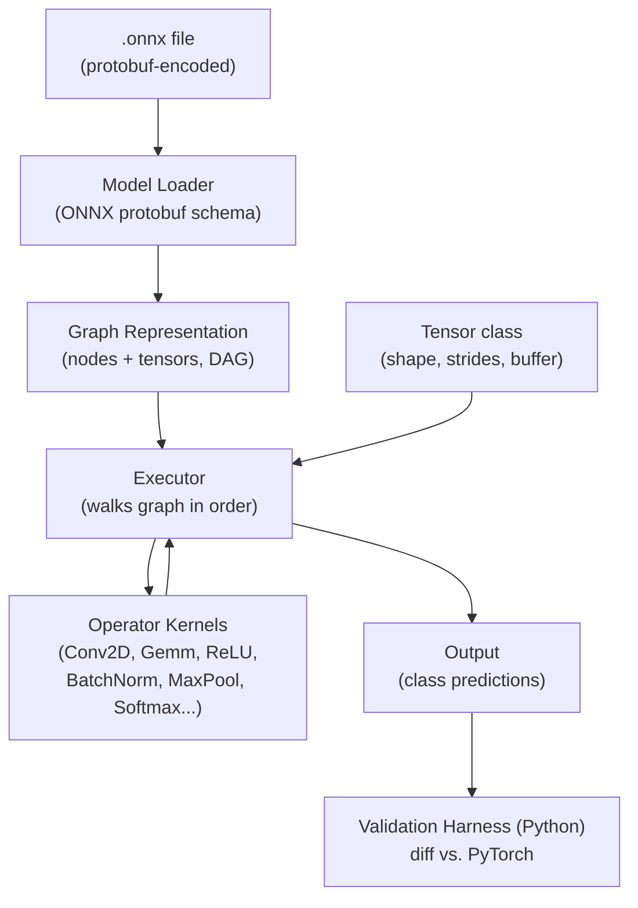

# Lyra: A Minimal Tensor Inference Engine in C++

Lyra loads a real ONNX model, parses its computation graph, and executes
inference on it using an engine written from scratch in C++17 — no PyTorch,
no ONNX Runtime, no TensorFlow at runtime. It correctly runs a full MobileNetV2
image classifier, verified numerically against PyTorch, and includes a
profiling-driven optimization pass that sped up the engine by ~2,900x.

## What it does

Given any photo (a local file or a URL) and a MobileNetV2 ONNX file, Lyra:

1. Parses the `.onnx` file's protobuf-encoded computation graph
2. Loads the real trained weights (including externally-stored tensors)
3. Executes the graph — Conv2D, BatchNorm, MaxPool, Softmax, and more — using
   hand-written C++ operator kernels
4. Prints a human-readable prediction with confidence, e.g. `258: Samoyed - 83.0%`
5. Automatically validates its own output against PyTorch's, to a tolerance of 1e-3

## Architecture



Everything left of the Python validation harness is pure C++, with zero
ML-framework dependency at inference time. The only external code used is
Google's Protobuf library, solely to *read* the ONNX file format — every
operator, the tensor class, the graph executor, and the memory management are
hand-written.

## Build Process

Lyra was built in seven stages, each with a verified deliverable before moving
to the next:

| Stage | Deliverable | Status |
|---|---|---|
| 1 | Parse ONNX file, print graph structure (nodes, shapes, op types) | Done |
| 2 | Tensor class + Add/MatMul/ReLU kernels, verified on hand-computed data | Done |
| 3 | Tiny hand-built MLP running end-to-end, output matched PyTorch exactly | Done |
| 4 | Conv2D, BatchNorm, MaxPool, Softmax — full CNN operator set | Done |
| 5 | Real MobileNetV2 loaded and executed, output matched PyTorch exactly | Done |
| 6 | Profiled and optimized Conv2D (im2col + GEMM) — 2,877x speedup | Done |
| 7 | This write-up | Done |

Each stage's correctness was checked before moving forward — the Stage 3 MLP
match against PyTorch and the Stage 5 MobileNetV2 match were both required
gates, not optional nice-to-haves. This mattered in practice: two real,
non-obvious bugs (described below) were only caught because the validation
step was strict rather than "close enough."

## Performance: Profiling and Optimizing Conv2D

Stage 6's goal was explicit: profile the engine, find the bottleneck, and
optimize it — expecting Conv2D to dominate. It did, at 99% of total runtime.

### The optimization arc

| State | Total graph time | Speedup vs. naive |
|---|---|---|
| A: Naive Conv2D, Debug build | 98,620 ms | 1x |
| B: + im2col/GEMM, Debug build | 820 ms | 120x |
| C: + fixed matmul indexing, Debug build | 456 ms | 216x |
| D: + Release build (`-O3`) | 34 ms | **2,877x** |

(An earlier commit in this repo's history cites "258x." That number likely
reflects a narrower measurement — such as the per-operation speedup on a
single regular convolution, which is separately noted below as 250–350x —
rather than the whole-graph, Debug-to-Release comparison used in the table
above. The 2,877x figure is the complete measurement: naive Debug build all
the way through to the optimized Release build.)

### What actually happened at each step

**Naive Conv2D to im2col + GEMM.** The original Conv2D used six nested loops —
a direct, correct, but cache-unfriendly implementation. im2col restructures
convolution as a single large matrix multiply (rearranging input patches into
columns, then reusing the engine's own `matmul()`), which is both algorithmically
better-suited to CPU cache behavior and reduces duplicate logic.

**The first im2col attempt was only 1.1x faster.** Profiling showed the real
cost wasn't the algorithm — it was `Tensor::at()`, which builds a
`std::vector<int>` on every single element access to compute a strided index.
Every multiply-accumulate in `matmul()` was paying for a heap allocation.
Rewriting `matmul()` (and later, the same pattern in the Gemm layer's
weight-transpose step) to use raw pointer arithmetic instead of coordinate-based
indexing is what actually unlocked the speedup — the algorithm was right the
whole time; the data structure's convenience API was silently the bottleneck.

**Debug vs. Release build.** After both algorithmic fixes, switching from an
unoptimized (`-O0`) to an optimized (`-O3`) build cut total time by another
13x, on top of the algorithmic gains — a reminder that compiler optimization
and algorithmic optimization are separate levers, and profiling a Debug build
in isolation can be misleading.

### Correctness was never traded for speed

Every optimization was verified bit-identical (not just "close enough")
against the original naive implementation on real MobileNetV2 activations —
including both regular and depthwise (grouped) convolutions — before being
adopted. Final output still matches PyTorch to a max difference of `1.4e-5`
across all 1000 output classes.

### Where the remaining time goes (Release build)

```
Conv        52 nodes   32.19 ms   93.9%
Gemm         1 node     1.04 ms    3.0%
Clip        35 nodes    0.95 ms    2.8%
ReduceMean   1 node     0.05 ms    0.2%
Add         10 nodes    0.04 ms    0.1%
Reshape      1 node     0.002 ms   0.0%
TOTAL      100 nodes   34.27 ms
```

Conv2D remains the dominant cost, as expected for a CNN — but 34ms end-to-end
for a 100-node network is now firmly in a practical range. The next
optimization target would be depthwise convolutions specifically: their
per-group GEMM operations are small ([1,9]x[9,49] for a typical 3x3 depthwise
layer) and don't fully amortize setup cost, which is why they saw a 53-108x
speedup rather than the 250-350x seen on regular (pointwise) convolutions.

## Bugs Hit Along the Way

Two real, non-obvious correctness bugs surfaced during development. Both are
included here deliberately — finding and understanding them was as valuable
as the parts of the project that worked on the first try.

### The silent external-data bug

When MobileNetV2 was first loaded, Lyra ran without crashing and produced a
plausible-looking output — but the result was identical regardless of the
input image. The root cause: ONNX spills large tensors (anything over ~1KB)
into a separate side-car file (`model.onnx.data`) rather than storing them
inline, once a model is large enough. Lyra's tensor loader only ever read the
inline storage path, so every externally-stored weight silently loaded as
all-zeros — with no error, since zero is a perfectly valid tensor value.
Conv2D's output collapsed to just its bias term (`sum(input * 0) + bias`),
which explained the input-independent, but numerically plausible, result.
The fix: an `ExternalDataLoader` that resolves the side-car file, plus a hard
failure (instead of silent zero-fill) if a loaded tensor's size doesn't match
its declared shape — turning this entire class of bug from "silently wrong"
into "loudly broken."

### The hidden indexing bottleneck

Covered above in the performance section: the first im2col implementation
barely improved speed, because the actual bottleneck was `Tensor::at()`'s
per-call heap allocation, not the convolution algorithm itself. Profiling —
not intuition — is what revealed this.

## Known Limitations

- **Asymmetric padding and dilation are not supported.** Attribute parsing
  currently reads only the first value of ONNX's `pads`/`strides` lists,
  which is correct for MobileNetV2 (symmetric padding, dilation=1) but would
  silently mis-compute on a model that uses either feature.
- **Depthwise convolutions have less optimization headroom** than regular
  convolutions under the current im2col approach, for the reason noted above.
  A dedicated depthwise kernel that skips im2col entirely would close this gap.
- **No backward pass / training support.** Lyra is a forward-pass-only
  inference engine, matching the scope of production inference runtimes.

## Setup and Usage

### Requirements
- C++17 compiler (tested with Apple Clang)
- CMake 3.15+
- Protobuf (`brew install protobuf`)
- Python 3 with `torch`, `torchvision`, `onnx`, `Pillow` (for the validation
  harness and model export only — not required to build or run the engine itself)

### Build
```bash
mkdir build-release && cd build-release
cmake -DCMAKE_BUILD_TYPE=Release ..
cmake --build .
```

### Regenerate the ONNX protobuf bindings (one-time)
```bash
protoc --cpp_out=third_party --proto_path=third_party third_party/onnx.proto3
```

### Export models (one-time, downloads real pretrained weights)
```bash
python3 export_model.py        # tiny hand-built MLP, for Stage 2/3 testing
python3 export_mobilenet.py    # real MobileNetV2, ImageNet-pretrained
```

### Classify an image
```bash
# Default sample image
python3 prepare_and_validate.py

# Your own local image
python3 prepare_and_validate.py path/to/photo.jpg

# Any image URL
python3 prepare_and_validate.py "https://example.com/photo.jpg"

# Run the engine
./build-release/lyra mobilenetv2.onnx
```

Each run prints Lyra's top-5 predictions with confidence percentages, and an
automated PASS/FAIL check against PyTorch's output on the same input.

## What I Learned

This project was about understanding what happens between "load weights" and
"get output" — the layer every ML framework normally hides. Building it
surfaced several things that are easy to state abstractly but only really
sink in by hitting them directly: that a "no crash" result doesn't mean
"correct" (the external-data bug), that intuition about what's slow is often
wrong until measured (the `at()` bottleneck), and that compiler flags and
algorithmic choices are separate, multiplicative levers on performance. The
2,877x speedup wasn't the result of one clever idea — it was three,
discovered in sequence, each one only visible after fixing the last.
